# Java SE 8 技術手冊勘誤

## 導讀 vii

   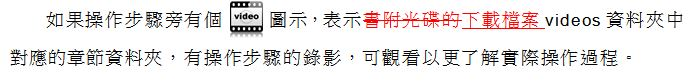

## P1-9

   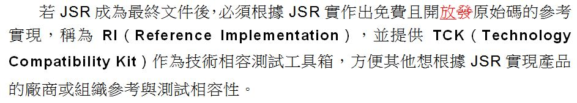

## P1-13

   

## P2-15

   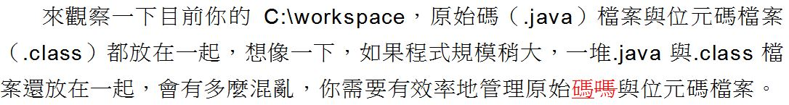

## P2-18

   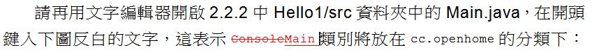

## P2-20

   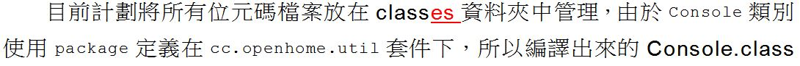

## P3-25

   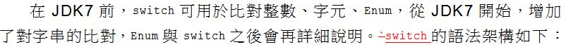

## P4-5

   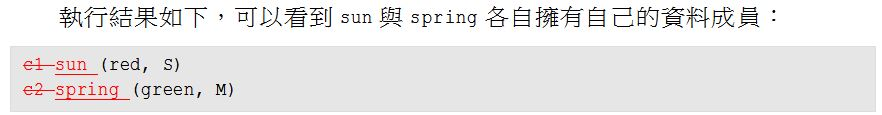

## P4-8

   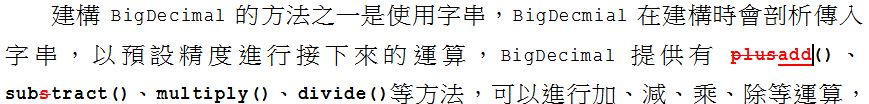

## P4-13

   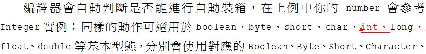

## P4-17

   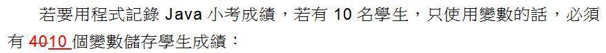

## P4-19

   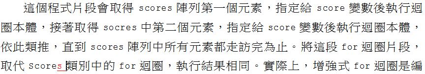

## P4-32

   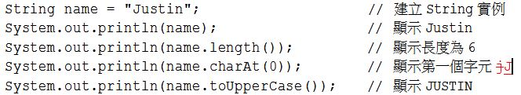

## P5-14

   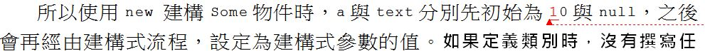

## P5-18

   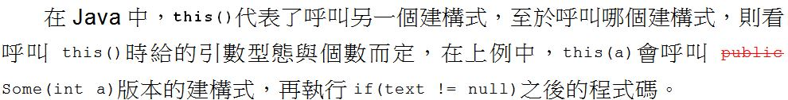

## P5-24

   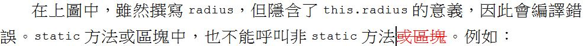

## P5-34

   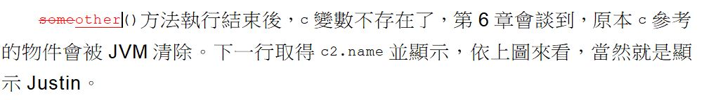

## P6-10

   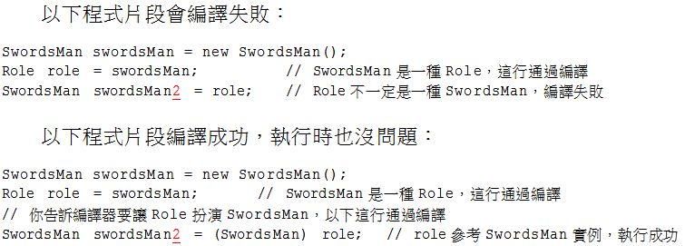

## P6-14

   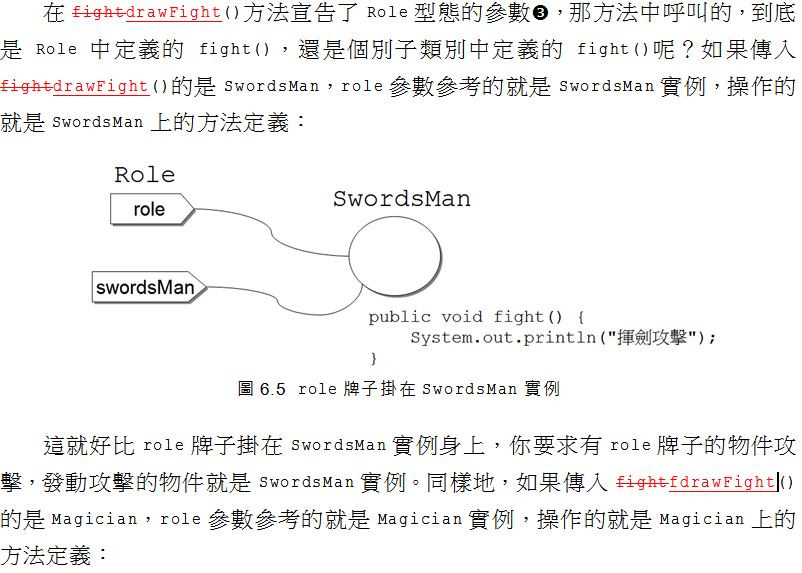

## P6-32

   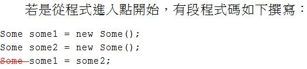

## P6-34

   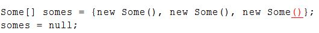

## P6-38

   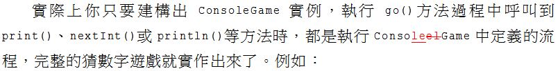

## P7-9

   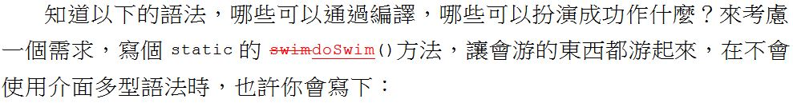

## P7-23

   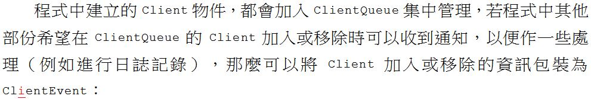

## P8-24

   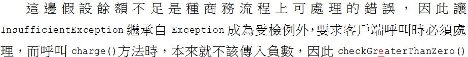

## P9-6

   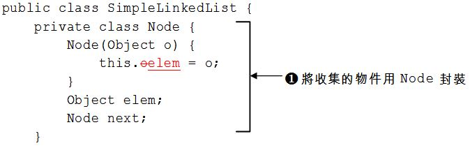

## P9-7

   

## P9-10

   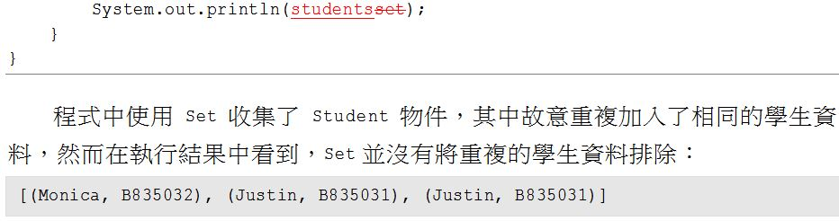

## P9-13

   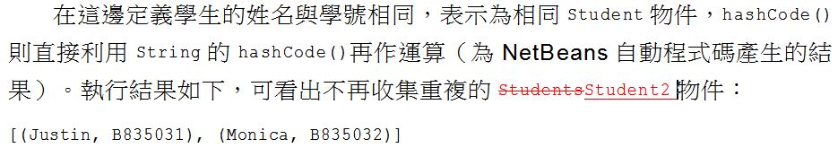

## P9-26

   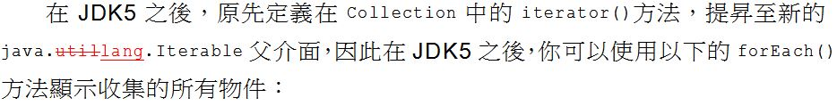

## P10-7

   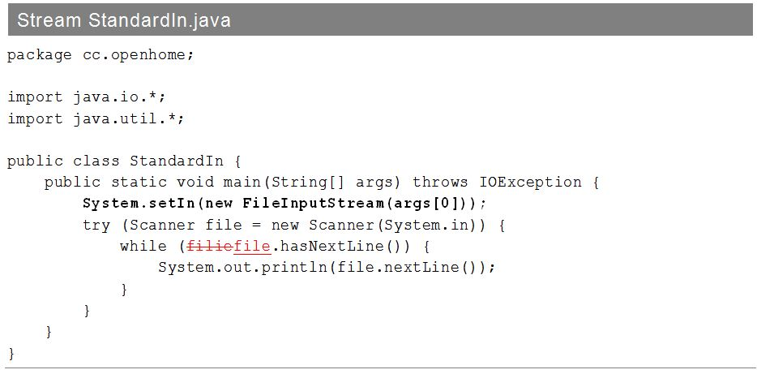

## P10-8

   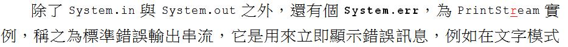

## P12-41

   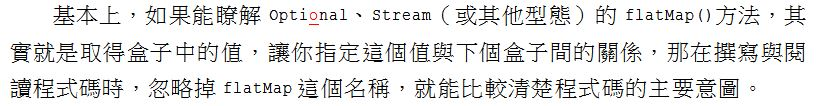

## P12-35

   
   
## P12-46

   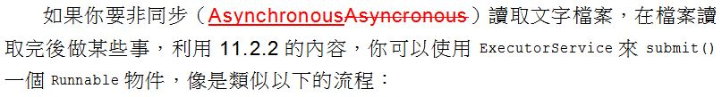

## P13-18

   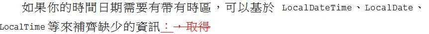

## P18-9

   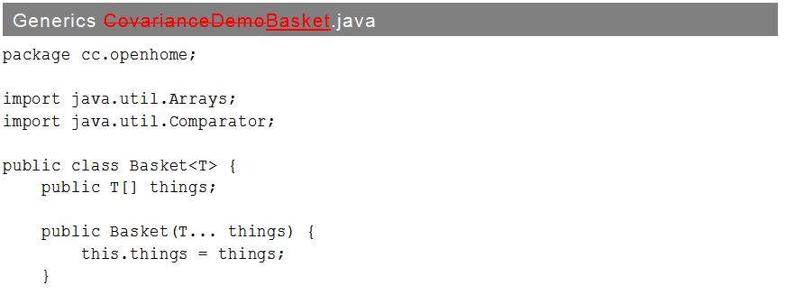

## A-2

   